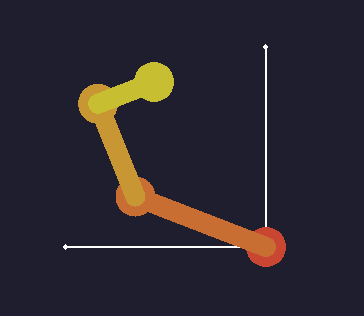

# RobotKinematic

A small pet project focused on exploring 2D robotic kinematics, including both forward and inverse motion.
Built in C++ with SFML for interactive visualization and Eigen for all vector and matrix computations.

The goal is to create a lightweight, hands-on playground to experiment with robotic motion and better understand the geometry behind it.

## To Do

- [ ] Refactor using clean architecture 
- [ ] Add tests
- [ ] Clean up (Hacks and Fixmes)
- [ ] Refactor robot model (links & joints)
- [ ] Add reachability space view
- [ ] Add a visualisation of the followed trajectory
- [ ] Implement analytical inverse kinematic on simple cases (2 or 3 segments)
- [ ] Implement FABRIK inverse kinematic algorithm
- [ ] Add robot loading from configuration file
- [ ] Add trajectory following
- [ ] Add obstacle avoidance ?
- [ ] Add UI (Qt ?)
- [ ] Add manual control of joints.
- [ ] Add support for linear joints ?
- [ ] Add support for 2D parallel robots ?